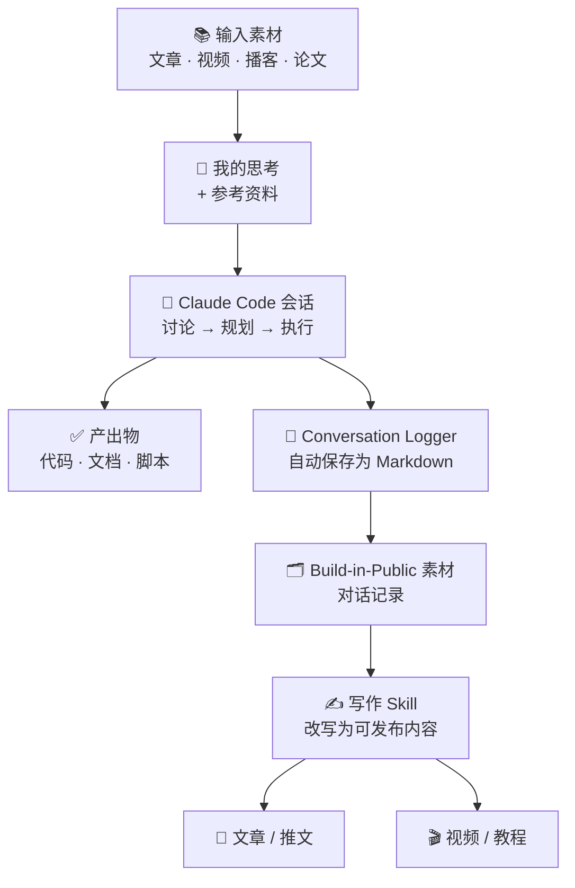

# Conversation Logger for Claude Code

自动将每次 Claude Code 会话保存为 Markdown 文件——零 Token 消耗，实时更新，兼容 Obsidian 及任意 Markdown 编辑器。

[English](README_EN.md)

---

## 为什么需要它

AI 辅助工作的典型流程是这样的：



与 Claude 的对话过程——真实的来回交流——是最有价值的 build-in-public 内容。这个工具自动捕获它，让你可以标注、加工后公开发布。

---

## 会增加 Token 消耗吗？

**不会。零消耗。**

Conversation Logger 以 Claude Code Hook 方式运行——一个普通 Python 脚本，由三个会话事件（`SessionStart`、`UserPromptSubmit`、`Stop`）触发。它只做文件读写：读取会话记录，写入 Markdown。**不调用 LLM，不调用 API，不消耗任何 Token。**

唯一的额外开销是每次 Hook 触发时几毫秒的 Python 启动时间，不会出现在你的 Anthropic 账单上。

---

## 捕获内容

| 会捕获 | 不捕获 |
|---|---|
| 你的消息 | Thinking 块（内部推理过程） |
| Claude 的文字回复 | 完整工具输出（如读取的文件内容） |
| 新建的文件（`Write`） | 对现有文件的编辑操作 |
| Skill 调用 | 常规 Bash 命令 |
| MCP 工具调用 | 工具返回结果 / 系统注入内容 |

每轮对话会自动生成一个简短的三级标题（取自你消息的第一行），让文档可以通过目录快速检索。

---

## 安装

### 方式一：通过 Claude Code Skill（推荐）

在任意 Claude Code 会话中输入：

```
/conversation-logger
```

Claude 会询问你的输出目录，并自动完成配置。

### 方式二：手动安装

**1. 下载脚本**

```bash
mkdir -p ~/.claude/scripts/conversation-logger/state
curl -o ~/.claude/scripts/conversation-logger/logger.py \
  https://raw.githubusercontent.com/huasan2025/conversation-logger/main/scripts/logger.py
chmod +x ~/.claude/scripts/conversation-logger/logger.py
```

**2. 配置输出目录**

方式 A：设置环境变量（推荐，无需修改文件）：

```bash
# 加入你的 ~/.zshrc 或 ~/.bashrc
export CLAUDE_CONVERSATIONS_DIR="$HOME/Documents/MyVault/Conversations"
```

方式 B：直接编辑脚本顶部的配置行：

```python
CONVERSATIONS_DIR = os.environ.get(
    "CLAUDE_CONVERSATIONS_DIR",
    os.path.expanduser("~/Documents/Conversations"),  # ← 改这里
)
```

**3. 在 `~/.claude/settings.json` 中添加 Hook**

在 `"hooks"` 对象中加入以下内容：

```json
"SessionStart": [
  {
    "matcher": "",
    "hooks": [
      {
        "type": "command",
        "command": "python3 ~/.claude/scripts/conversation-logger/logger.py session-start",
        "timeout": 10
      }
    ]
  }
],
"UserPromptSubmit": [
  {
    "matcher": "",
    "hooks": [
      {
        "type": "command",
        "command": "python3 ~/.claude/scripts/conversation-logger/logger.py user-prompt",
        "timeout": 10
      }
    ]
  }
],
"Stop": [
  {
    "matcher": "",
    "hooks": [
      {
        "type": "command",
        "command": "python3 ~/.claude/scripts/conversation-logger/logger.py stop",
        "timeout": 30
      }
    ]
  }
]
```

> 如果你已有 `Stop` Hook（例如通知提醒），将这条记录追加到已有数组中，不要替换。

**4. 验证**

```bash
python3 -c "import json, os; json.load(open(os.path.expanduser('~/.claude/settings.json'))); print('JSON 格式正确')"
```

开启一个新的 Claude Code 会话，发几条消息，然后 `/exit`。在你的 `CONVERSATIONS_DIR` 目录下应该出现一个新的 `.md` 文件。

---

## 回放历史会话

将任意历史会话转换为 Markdown：

```bash
# 查找你的会话记录
ls ~/.claude/projects/

# 转换指定会话
python3 ~/.claude/scripts/conversation-logger/logger.py replay \
  ~/.claude/projects/<项目目录>/<会话uuid>.jsonl \
  ~/Documents/Conversations/2024-01-01-my-session.md
```

---

## 输出格式示例

每个会话生成一个带 YAML 前置信息的 Markdown 文件：

```markdown
---
date: 2024-01-15 14:30
project: my-project
session_id: abc123
type: conversation
tags: []
---

# 2024-01-15 my-project

### 介绍一下 Hook 系统

**User:**

介绍一下 Hook 系统

---

**Assistant:**

Claude Code 的 Hook 系统允许你在会话事件触发时运行 shell 命令……

> 📝 New file: `docs/hooks-overview.md`
> 🎯 Skill: `superpowers:brainstorming`

---
```

---

## 配置参考

| 方式 | 操作 |
|---|---|
| 环境变量 | `export CLAUDE_CONVERSATIONS_DIR="/path/to/folder"` |
| 修改脚本 | 编辑 `logger.py` 顶部的 `CONVERSATIONS_DIR` |
| 按项目隔离 | 在项目 `.envrc` 或 shell profile 中设置环境变量 |

---

## 工作原理

三个 Claude Code Hook 以不同参数调用同一个 Python 脚本：

| Hook | 触发时机 | 动作 |
|---|---|---|
| `SessionStart` | 新会话开始 | 创建 `.md` 文件，写入前置信息 |
| `UserPromptSubmit` | 你发送消息时 | 将你的消息追加写入文件 |
| `Stop` | Claude 完成一轮回复后 | 将 Claude 回复和工具摘要追加写入文件 |

脚本在 `~/.claude/scripts/conversation-logger/state/` 中为每个会话维护一个状态文件，记录已写入的 assistant 轮次数，避免同一会话多次 `Stop` 事件导致重复写入。

所有异常都被静默捕获——Hook 永远不会中断或崩溃你的 Claude Code 会话。
