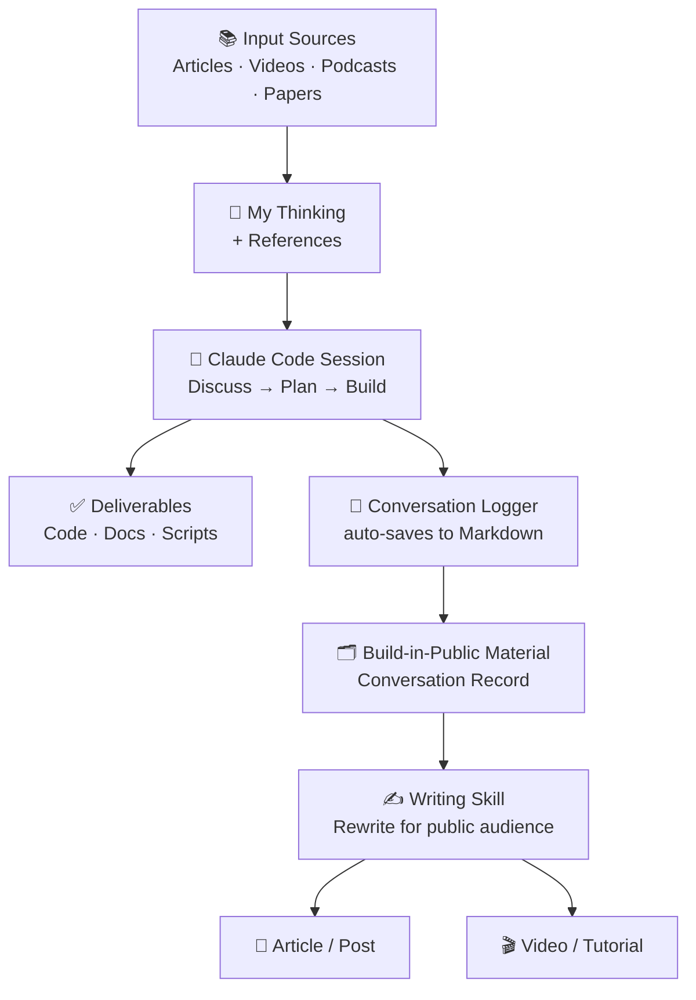

# Conversation Logger for Claude Code

Automatically save every Claude Code session to a Markdown file — zero token cost, real-time updates, works with Obsidian and any Markdown editor.

[中文](README.md)

---

## Why

The typical AI-assisted workflow looks like this:



The conversation record — the actual back-and-forth with Claude — is the most authentic build-in-public content you have. This tool captures it automatically so you can annotate and publish it.

---

## Does this cost extra tokens?

**No. Zero.**

The logger runs as a Claude Code hook — a plain Python script triggered by three session events (`SessionStart`, `UserPromptSubmit`, `Stop`). It does pure file I/O: reads the session transcript and writes Markdown. **No LLM calls, no API calls, no token usage.**

The only overhead is a few milliseconds of Python startup per hook event. It will not appear on your Anthropic bill.

---

## What gets captured

| Captured | Not captured |
|---|---|
| Your messages | Thinking blocks (internal reasoning) |
| Claude's text replies | Full tool outputs (e.g., file contents read) |
| New files created (`Write`) | Edit operations on existing files |
| Skill invocations | Routine Bash commands |
| MCP tool calls | Tool results / system injections |

Each conversation turn gets a short auto-generated section heading (H3) derived from your first line, making the document navigable via table of contents.

---

## Installation

### Option 1: Via Claude Code Skill (recommended)

Invoke the skill in any Claude Code session:

```
/conversation-logger
```

Claude will ask for your output directory and handle the rest.

### Option 2: Manual installation

**1. Download the script**

```bash
mkdir -p ~/.claude/scripts/conversation-logger/state
curl -o ~/.claude/scripts/conversation-logger/logger.py \
  https://raw.githubusercontent.com/huasan2025/conversation-logger/main/scripts/logger.py
chmod +x ~/.claude/scripts/conversation-logger/logger.py
```

**2. Set your output directory**

Option A — environment variable (no file editing needed):

```bash
# Add to your ~/.zshrc or ~/.bashrc
export CLAUDE_CONVERSATIONS_DIR="$HOME/Documents/MyVault/Conversations"
```

Option B — edit the script directly:

```python
CONVERSATIONS_DIR = os.environ.get(
    "CLAUDE_CONVERSATIONS_DIR",
    os.path.expanduser("~/Documents/Conversations"),  # ← change this
)
```

**3. Add hooks to `~/.claude/settings.json`**

Add inside the `"hooks"` object:

```json
"SessionStart": [
  {
    "matcher": "",
    "hooks": [
      {
        "type": "command",
        "command": "python3 ~/.claude/scripts/conversation-logger/logger.py session-start",
        "timeout": 10
      }
    ]
  }
],
"UserPromptSubmit": [
  {
    "matcher": "",
    "hooks": [
      {
        "type": "command",
        "command": "python3 ~/.claude/scripts/conversation-logger/logger.py user-prompt",
        "timeout": 10
      }
    ]
  }
],
"Stop": [
  {
    "matcher": "",
    "hooks": [
      {
        "type": "command",
        "command": "python3 ~/.claude/scripts/conversation-logger/logger.py stop",
        "timeout": 30
      }
    ]
  }
]
```

> If you already have a `Stop` hook (e.g., a notification), append this entry to the existing array — don't replace it.

**4. Verify**

```bash
python3 -c "import json, os; json.load(open(os.path.expanduser('~/.claude/settings.json'))); print('JSON valid')"
```

Start a new Claude Code session, send a couple of messages, then `/exit`. A `.md` file should appear in your `CONVERSATIONS_DIR`.

---

## Replay historical sessions

Convert any past session to Markdown:

```bash
# Find your session transcripts
ls ~/.claude/projects/

# Convert one
python3 ~/.claude/scripts/conversation-logger/logger.py replay \
  ~/.claude/projects/<project-dir>/<session-uuid>.jsonl \
  ~/Documents/Conversations/2024-01-01-my-session.md
```

---

## Output format

Each session produces a Markdown file with YAML frontmatter:

```markdown
---
date: 2024-01-15 14:30
project: my-project
session_id: abc123
type: conversation
tags: []
---

# 2024-01-15 my-project

### Tell me about the hook system

**User:**

Tell me about the hook system

---

**Assistant:**

Claude Code's hook system lets you run shell commands in response to session events...

> 📝 New file: `docs/hooks-overview.md`
> 🎯 Skill: `superpowers:brainstorming`

---
```

---

## Configuration reference

| Method | How |
|---|---|
| Environment variable | `export CLAUDE_CONVERSATIONS_DIR="/path/to/folder"` |
| Edit script | Change `CONVERSATIONS_DIR` in `logger.py` |
| Per-project | Set env var in your shell profile or project `.envrc` |

---

## How it works

Three Claude Code hooks call the same Python script with different arguments:

| Hook | Trigger | Action |
|---|---|---|
| `SessionStart` | New session begins | Creates the `.md` file with frontmatter |
| `UserPromptSubmit` | You send a message | Appends your message to the file |
| `Stop` | Claude finishes a reply | Appends Claude's reply + tool summaries |

The script maintains a small state file per session (`~/.claude/scripts/conversation-logger/state/`) to track how many assistant turns have been logged, preventing duplicates across multiple `Stop` events in a session.

All exceptions are caught silently — the hook will never interrupt or crash your Claude Code session.
